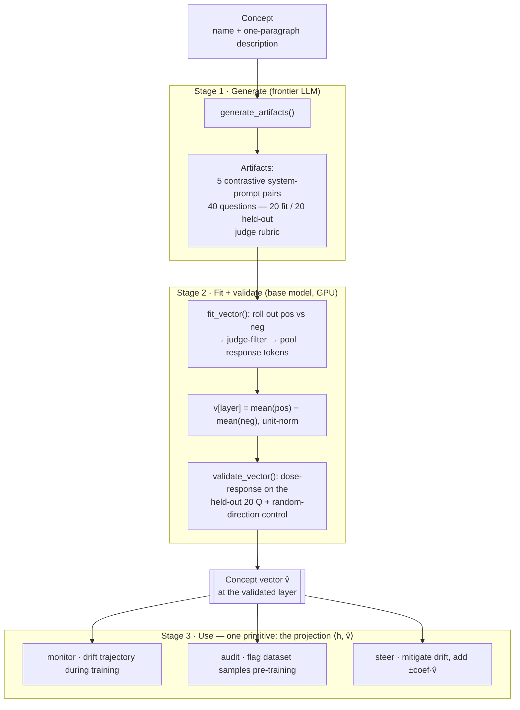

# ft-mechanistic-interface

A fine-tuning harness that optimises for more than loss. Drop in a model, a dataset,
and a use-case description; it mints **concept vectors** for the safety-critical axes of
that domain and uses them to **monitor drift during training**, **audit the dataset
before training**, and **mitigate drift** — so a model that looks clean on the loss
curve can't silently regress on an axis it was never tested on.

Method and citations: [`docs/vector-steering.md`](docs/vector-steering.md) (read first).

## How it works — three stages

A **concept** is just a `name + one-paragraph description` (e.g. `gender_bias`). From
that alone we derive a single **direction in the model's residual stream** that the model
moves along when it expresses the concept.

**Stage 1 — Generate the contrastive material (a frontier LLM does this).**
One meta-prompt → the LLM emits, for the concept: **5 contrastive system-prompt pairs**
(`pos` commands the trait, `neg` commands the opposite), **~40 elicitation questions**
that *could* surface the trait without asking for it (split disjointly into 20 for
fitting / 20 held out for validation), and a **judge rubric**. The contrastive data is
LLM-generated *from a description* — not hand-written prompts, and not your fine-tuning
dataset (that's the "Chen-exact" pipeline, [Chen+ 2507.21509](https://arxiv.org/abs/2507.21509)).

**Stage 2 — Fit the vector (on the base model, on the GPU).**
On the base model, run each question under a `pos` and a `neg` system prompt, sampling a
few rollouts. **Judge-filter** each response (keep `pos` answers scoring high on the
trait, `neg` answers scoring low; refusals/incoherent answers score low and drop out so
they don't poison the average). For the kept responses, take the **mean residual-stream
activation over the response tokens** at every layer, then:

```
v[layer] = mean(positive responses) − mean(negative responses)        (unit-normalised)
```

That difference-of-means *is* the concept vector. It is then **validated** by a free-form
dose-response gate (does `+coef·v̂` raise the judged trait, monotonically, with coherence
intact?) against a **random-direction control**, which also selects the steering layer.

**Stage 3 — Use it (one primitive, three uses).**
Everything downstream is the scalar projection `⟨h, v̂⟩` of an activation onto the unit
direction: **monitor** drift during training, **audit** a dataset before training,
**steer** to mitigate.



## Layout

The **application** is the unit of work: one safety-critical app = a dataset + its
concept set + a model recipe. Code is organised by *function* (shared, DRY); configs and
artifacts are organised by *application*.

```
ft-mechanistic-interface/
├── README.md
├── pyproject.toml                  # one `ftmi` CLI entry point
├── docs/
│   ├── vector-steering.md          # method + citations (read first)
│   └── design-decisions.md         # open calls, terse
├── configs/                        # a run is a config, not a code edit
│   ├── applications/               # ONE file per safety-critical app (the unit of work)
│   │   └── therapist.yaml          #   wires dataset + concepts + lora + monitor/audit/mitigate
│   ├── concepts/                   # {name, description} per axis — authored or proposed
│   │   └── therapist.yaml
│   └── lora/                       # reusable LoRA recipes, shared across apps
│       └── qwen7b_default.yaml
├── data/                           # datasets + artifacts, namespaced per app (gitignored)
│   └── therapist/
├── scripts/
│   └── smoke_fit_vector.py         # end-to-end smoke: mint one vector + steering sanity
├── src/ftmi/                       # organised by FUNCTION, never per-app (DRY)
│   ├── cli.py                      # thin entry points; no logic
│   ├── config.py                   # typed config loading (YAML → dataclasses)
│   ├── llm.py                      # API backend: frontier LLM (artifact author + judge)
│   ├── model.py                    # on-device backend: base model on GPU (generate + pool)
│   ├── data/
│   │   └── loaders.py              # chat-JSONL dataset loader
│   ├── vectors/                    # the pipeline
│   │   ├── generate.py             #   Stage 1 — concept → artifacts (Chen meta-prompt)
│   │   ├── extract.py              #   Stage 2 — diff-of-means fit → PersonaVector
│   │   ├── judge.py                #   Stage 2 — trait+coherence judge-filter (keep-rule)
│   │   ├── validate.py             #   Stage 2 — dose-response gate + random control
│   │   ├── pipeline.py             #   mint_vector(): generate → fit → validate (CLI loops this)
│   │   └── monitor.py              #   Stage 3 — projection: drift, audit, detection AUC
│   ├── steering/
│   │   └── hooks.py                #   Stage 3 primitive ⟨h, v̂⟩ (read / add / cap)
│   └── train/
│       └── lora.py                 #   LoRA recipe + DriftMonitor callback
└── tests/                          # pure-function seams (no GPU)
    └── test_vectors.py
```

### Key modules

| File | Role | Key functions |
|---|---|---|
| `config.py` | typed config; the `Concept` (name + description) | `Concept`, `ApplicationConfig.load` |
| `llm.py` | **API backend** — frontier LLM, used for artifact authoring *and* judging | `get_generator(backend, model)` |
| `model.py` | **On-device backend** — base model on the GPU (local counterpart to `llm.py`) | `LocalModel.load`, `.generate`, `.pooled_response` |
| `vectors/generate.py` | Stage 1 — concept → artifacts | `generate_artifacts`, `META_PROMPT`, `propose_concepts` |
| `vectors/extract.py` | Stage 2 — the diff-of-means fit | `fit_vector`, `fit_from_pooled`, `PersonaVector` |
| `vectors/judge.py` | Stage 2 — the keep-rule | `judge_response` → `(trait, coherence)` |
| `vectors/validate.py` | Stage 2 — the §4 validation gate | `validate_vector`, `random_like` |
| `vectors/pipeline.py` | orchestrator the CLI loops over | `mint_vector` |
| `steering/hooks.py` | Stage 3 primitive `⟨h, v̂⟩` | `ProjectionReader`, `add_steering`, `add_cap` |
| `vectors/monitor.py` | Stage 3 uses | `projection_difference`, `flag_samples`, `score_generations` |

## Design principles

- **Config in, code fixed.** A new application is a new YAML, never an edited script.
- **Application-centric configs, function-centric code.** Apps differ in config/data; the
  pipeline code is shared and never forked per app.
- **One primitive, three uses.** Generate → fit → project. Monitoring, dataset audit, and
  mitigation are all `⟨h, v̂⟩` against the same vectors.
- **Validated before trusted.** No vector is used for steering until it passes the
  free-form dose-response gate with random-direction and neutral-data controls
  (`docs/vector-steering.md` §4–5).

## Quickstart

Artifact **generation** and the **judge** call a frontier LLM (default Gemini, via
`ftmi.llm`); base-model rollouts + activation extraction run locally on GPU. Copy
`.env.example` → `.env` and set `GEMINI_API_KEY` (plus `HF_TOKEN` for gated base models).
The generator/judge model is `FTMI_GEN_MODEL` (or `--gen-model`).

```bash
uv sync
cp .env.example .env          # then fill in GEMINI_API_KEY

# end-to-end smoke: mint one gender_bias vector + steering sanity
uv run python scripts/smoke_fit_vector.py --questions 20 --rollouts 5

# 0. (optional) propose concepts from the dataset if no use-case descriptions exist
uv run ftmi concepts --data data/therapist/sft.jsonl --domain therapist > configs/concepts/therapist.yaml
# 1. mint + validate concept vectors for the application
uv run ftmi vectors  --concepts configs/concepts/therapist.yaml --model <base>
# 2. fine-tune with training-time drift monitoring + dataset audit
uv run ftmi train    --app configs/applications/therapist.yaml
```

Status: scaffold. The vector pipeline (generate → fit → validate) runs end-to-end; the
training loop and CLI wiring are being filled in.
